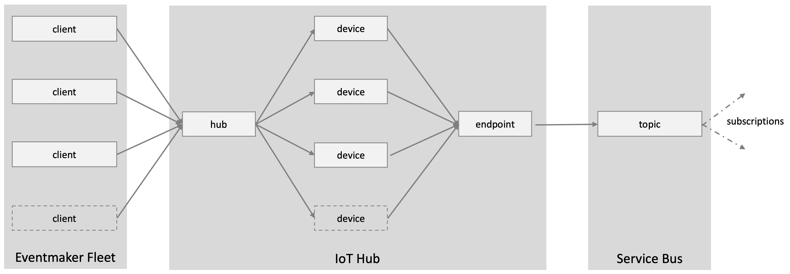

# eventmaker

Creates and configures Azure IoT Hub with virtual devices and sends mocked events to them. Works both locally, from developer workstation as well as in a fleet from Azure Container Instances (ACI)



## setup

To run `eventmaker` start by editing a couple variable in the [script/config](script/config) file:

```shell
HUB_NAME="cloudylabs"
NUMBER_OF_DEVICES=3
METRIC_CONFIG="https://raw.githubusercontent.com/mchmarny/eventmaker/master/config/thermostat.yaml"
```

* `HUB_NAME` is the name of the Azure IoT Hub that will be created 
* `NUMBER_OF_DEVICES` is the number of devices that will be created in the HUB and number of virtual devices that will be created in ACI to generate events
* `METRIC_CONFIG` is either path or a URL to metric configuration file 

> assumes you have subscription id, resource group and location defaults set 

Create a IoT Hub with a custom message routing to a new Service Bus topic (execution time: ~5 min)

```shell
bin/hub-up
```

When completed, the final message will read "IoT Hub configuration done"

## fleet 

Now that the IoT Hub is up, you can deploy the fleet of devices with a corresponding Container Instances in Azure service that send mocked events to these devices

```shell
bin/fleet-up
```

> The deployment is asynchronous so if you want to see the result open the ACI dashboard in Azure Portal. Note, may take a ~30 seconds for the first image to appear in the UI

## events 

The mocked event generated by each device in the fleet will look like this

```json
{
    "id": "fdf612b9-34a5-445e-9941-59c404ea9bef",
    "src_id": "device-1",
    "time": 1589745397,
    "label": "temp",
    "data": 70.79129651786347,
    "unit": "celsius"
}
```

Where the `src_id` will be unique source ID for each device and the `id` set to a globally unique event ID

## metric templates 

`eventmaker` supports dynamic metric configuration. This configuration can be in a local file (`--file config/example.yaml`) or loaded from a URL (`--file https://raw.githubusercontent.com/mchmarny/eventmaker/master/config/thermostat.yaml`). The example bellow defines thermostat metrics (temp and humidity)

```yaml
--- 
metrics: 
- label: temperature
  frequency: "1s"
  unit: celsius
  template: 
    min: 86.1
    max: 107.5
    type: float
- label: humidity
  frequency: "1s"
  unit: percent
  template: 
    min: 0
    max: 100
    type: int
```

## cleanup 

To delete previously deployed fleet

```shell
bin/fleet-down
```

To delete hub and all of it's devices

> Note, this will delete the IoT Hub itself and all of its devices 

```shell
bin/hub-down
```


## Disclaimer

This is my personal project and it does not represent my employer. I take no responsibility for issues caused by this code. I do my best to ensure that everything works, but if something goes wrong, my apologies is all you will get.

## License
This software is released under the [Apache v2 License](./LICENSE)


