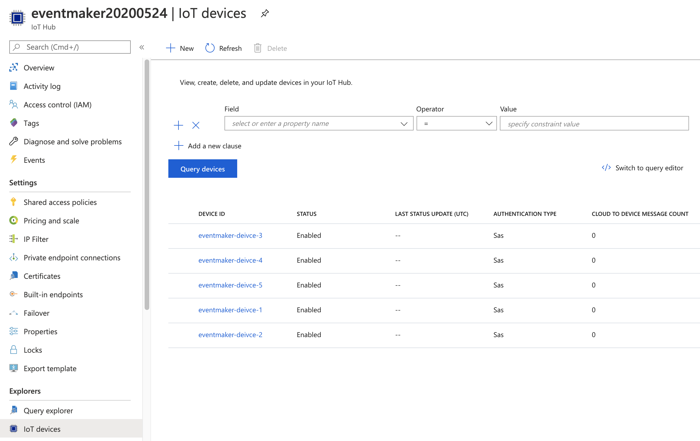

## Azure IoT Hub Publisher

## usage 

```shell
./eventmaker iothub --device <your device name>
                    --file conf/example.yaml \
                    --connect <your IoT Hub connection string>
```

You can locate the IoT Hub connection string using the Azure CLI 

```shell
az iot hub device-identity show-connection-string \
    --device-id <your IoT Hub device ID> \
    --hub-name <your IoT Hub name> \
    -o tsv
```

## configuration

`eventmaker` can also configures Azure IoT Hub with devices and launch a fleet of virtual event generators on Azure Container Instances to send data at configurable frequency. 


## setup

To run `eventmaker` start by editing a couple variable in the [bin/config](../bin/config) file:

```shell
HUB_NAME="eventmaker20200523"
NUMBER_OF_DEVICES=3
METRIC_CONFIG="https://raw.githubusercontent.com/mchmarny/eventmaker/master/conf/thermostat.yaml"
```

* `HUB_NAME` - name of the Azure IoT Hub that will be created (has to be globally unique)
* `NUMBER_OF_DEVICES` - number of devices to create 
* `METRIC_CONFIG` - path or a URL to metric configuration file (path or URL)

To calibrate the total number of events, combine the number of devices with the number of metrics on each devide and the frequency in which metrics are being sent (e.g. 10 devices generating 2 metrics every 1 second equal 1,200 events a minute) 

## hub

> Requires [Azure CLI](https://docs.microsoft.com/en-us/cli/azure/install-azure-cli?view=azure-cli-latest). Also, this readme assumes you have already (`az login`) and configured subscription id, resource group, and location defaults

To create an IoT Hub with a custom message route draining to a new Service Bus topic run `hub-up`  (execution time: ~5 min)

```shell
bin/hub-up
```

When completed, the final message will read "IoT Hub configuration done"

## fleet 

Now that the IoT Hub is up, you can deploy the fleet of devices with a corresponding Azure Container Instances service to mock events and send them. The number of devices that will be created is defined in the `NUMBER_OF_DEVICES` variable in [bin/config](../bin/config)

```shell
bin/fleet-up
```

> The deployment is asynchronous so if you want to see the result open the ACI dashboard in Azure Portal. Note, may take a ~30 seconds for the first image to appear in the UI


## data 

To review all the devices that were configured, go to IoT Hub in Azure portal



To monitor the messages that are being received by these devices, go to Service Bus


To see all the `eventmaker` instances that generate that data, go to Container Instances 


Additionally, you can analyze the data in Azure Time Series Insights


## cleanup 

To delete previously deployed fleet

```shell
bin/fleet-down
```

To delete hub and all of it's devices

> Note, this will delete the IoT Hub itself and all of its devices 

```shell
bin/hub-down
```

## development 

If you want to make changes and run the `eventmaker` locally, you will need an instance of IoT Hub and a device. To create these resources and setup your development environment run:

```shell
source bin/dev-up
```

When you done, cleanup previously created development resources 

```shell
source bin/dev-down
```

## Disclaimer

This is my personal project and it does not represent my employer. I take no responsibility for issues caused by this code. I do my best to ensure that everything works, but if something goes wrong, my apologies is all you will get.

## License
This software is released under the [Apache v2 License](../LICENSE)


